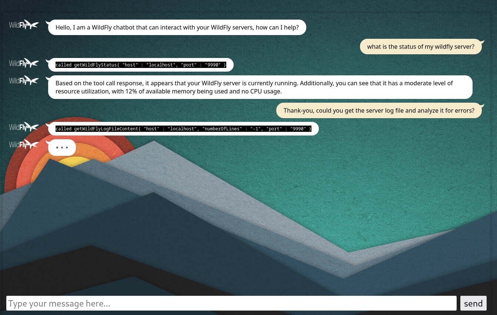

# WildFly Chat Bot

A WildFly Chat Bot. This WildFly Bootable jar application is a web based UI allowing you to interact with your WildFly servers using natural language.



By default the file `./mcp.json` is read. You can configure it with `-Dorg.wildfly.ai.chatbot.mcp.config=<path to file>`

1) Build the WildFly MCP server located in `../wildfly-mcp-server` (The chat bot will use it in its [default mcp.json](mcp.json) configuration).

2) Build the WildFly chat bot:

```
mvn clean install
```

3) Start the chat bot using local `ollama` (by default uses the `qwen2.5:3b`) model, once started it listens on port `8090`:

```
java -jar target/wildfly-chat-bot-bootable.jar

```

This chatbot has also been tried with the `llama3.2:3b` and provided good results.

3) Start the chat bot using [groq](https://console.groq.com/docs/openai), once started it listens on port `8090`:

```
GROQ_CHAT_MODEL_NAME=llama3-70b-8192 GROQ_API_KEY=<Your groq key> java -jar target/wildfly-chat-bot-bootable.jar -Dorg.wildfly.ai.chatbot.llm.name=groq
```

## Configuring the WildFly chatbot

| Env Variable    | Description |
| -------- | ------- |
| WILDFLY_CHAT_BOT_MCP_FILE  | Absolute path to the mcp.json file    |
| WILDFLY_CHAT_BOT_LLM_MODEL  | The active LLM model (`ollama` or `groq`)    |
| WILDFLY_MCP_SERVER_USER_NAME  | The default user name to use when connecting to WildFly server |
| WILDFLY_MCP_SERVER_USER_PASSWORD  | The default user password to use when connecting to WildFly server |

## Configuring the WildFly chatbot for ollama

| Env Variable    | Description |
| -------- | ------- |
| OLLAMA_CHAT_URL  | URL, default value `http://127.0.0.1:11434`    |
| OLLAMA_CHAT_MODEL_NAME | ollama model, default value `qwen2.5:3b`   |
| OLLAMA_CHAT_TEMPERATURE    | model temperature, by default `0.9`    |
| OLLAMA_CHAT_LOG_REQUEST    | log requests, by default `true`    |
| OLLAMA_CHAT_LOG_RESPONSE    | log responses, by default `true`    |

## Configuring the WildFly chatbot for groq

| Env Variable    | Description |
| -------- | ------- |
| GROQ_API_KEY   | Your API key |
| GROQ_CHAT_URL  | URL, default value `http://127.0.0.1:11434`    |
| GROQ_CHAT_MODEL_NAME | model, default value `qwen2.5:3b`   |
| GROQ_CHAT_LOG_REQUEST    | log requests, by default `true`    |
| GROQ_CHAT_LOG_RESPONSE    | log responses, by default `true`    |